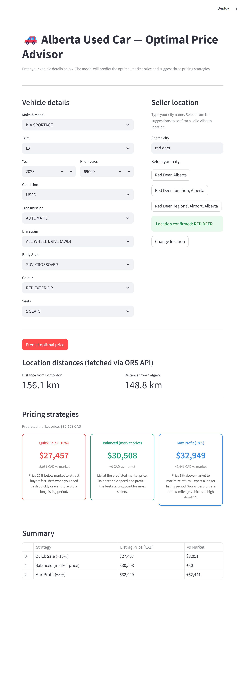

# Alberta Used Car Price Prediction

An end-to-end data engineering and machine learning system that predicts optimal listing prices for used cars in Alberta, trained on 18,000+ real listings.

Built as a final project for AIDA 1143 (Machine Learning) + AIDA 1145 (Data Engineering).

---

## What It Does

Private sellers in Alberta have no reliable way to price their used cars. Price too high — the car sits unsold for weeks. Price too low — the seller loses money.

This system solves that problem by:
- Cleaning and processing 18,000+ real Alberta used car listings
- Loading the data into a normalized 10-table SQL Server database
- Training a CatBoost regression model (Test R² = 0.89, MAE = $3,039 CAD)
- Serving live price predictions through a Streamlit web app with three pricing strategies

---
## Screenshot


## System Architecture

```
Raw CSV (Alberta used car listings)
        │
        ▼
ETL_Engine.py  ──►  AB_CarSale_DB (SQL Server, 10-table 3NF)
        │                    │
        │  ORS API            │  V_Y1 SQL View
        │  (road distances)   ▼
        │            Brain_Audit.ipynb
        │            (CatBoost training)
        │                    │
        │                    ▼
        └──────────►  app.py (Streamlit)
                      └─► predict.py + ORS API (live inference)
```

---

## Tech Stack

| Layer | Technology |
|-------|-----------|
| Language | Python 3.12 |
| Database | SQL Server (SSMS) |
| ML Model | CatBoost (gradient boosting) |
| Web App | Streamlit |
| Distance API | OpenRouteService (ORS) |
| Geocoding API | Open-Meteo (no key required) |
| ORM | SQLAlchemy |
| Secrets | python-dotenv |

---

## Model Performance

| Metric | CV Result (5-Fold) | Held-Out Test |
|--------|--------------------|---------------|
| R² | 0.7557 ± 0.0277 | **0.8886** |
| MAE | $4,161 ± $174 | **$3,039 CAD** |
| RMSE | $7,711 ± $567 | **$5,593 CAD** |

Three models were evaluated: Dummy Baseline, Random Forest, and CatBoost. CatBoost was selected for deployment.

---

## Repository Structure

```
AIDA-Final-project-001/
├── .env                          ← ORS API key (not committed — see setup below)
├── .gitignore
├── README.md
├── Data_Raw/
│   └── Optimized_Alberta_owner_sales_car_clean.csv   ← not committed
├── Data_Engineering/
│   └── Fortress_Build.sql        ← builds AB_CarSale_DB from scratch
├── Data_Science/
│   ├── ETL_Engine.py             ← extract, transform, load + ORS distance calls
│   ├── app.py                    ← Streamlit web application
│   ├── training/
│   │   ├── Y1_model_catboost.py  ← trains the price prediction model
│   │   ├── Y1_model_random_forest.py
│   │   └── Y2_model_catboost.py  ← days-to-sell attempt (failed — documented)
│   ├── inference/
│   │   └── predict.py            ← live inference module
│   └── models/
│       └── catboost_price_model.pkl   ← generated after training
└── Docs/
    ├── Brain_Audit.ipynb         ← full ML audit notebook
    ├── Portfolio_Document.docx
    └── Run_Instructions.docx
```

---

## Setup & Usage

### Prerequisites

- Python 3.9+
- SQL Server with ODBC Driver 17
- Conda (recommended) or pip
- Free ORS API key from [openrouteservice.org](https://openrouteservice.org)

### 1. Install Dependencies

```bash
pip install pandas sqlalchemy pyodbc requests python-dotenv scikit-learn catboost streamlit joblib matplotlib
```

### 2. Configure API Key

Create a `.env` file at the project root:

```
ORS_API_KEY=your_key_here
```

> **Windows note:** Make sure the file is named `.env` and not `.env.txt`. Go to View → Show → File name extensions in Explorer to confirm.

### 3. Build the Database

Open `Fortress_Build.sql` in SSMS. Switch the active database to `master`, then execute the full script. This creates `AB_CarSale_DB` with all 10 tables, constraints, indexes, triggers, and views from scratch.

### 4. Run the ETL Pipeline

```bash
conda activate ml-env
python Data_Science/ETL_Engine.py
```

Loads all vehicle records and calls the ORS API to compute driving distances from Edmonton and Calgary for every city (~3 minutes for 53 cities at 1.5s per call).

### 5. Train the Model

```bash
python Data_Science/training/Y1_model_catboost.py
```

Saves the trained pipeline to `Data_Science/models/catboost_price_model.pkl`.

### 6. Launch the App

```bash
streamlit run Data_Science/app.py
```

Opens in the browser. Enter vehicle details and a city name to receive a live price prediction with three pricing strategy cards.

---

## Data

The training data consists of 18,000+ used car listings collected from the Alberta market over approximately 5 weeks. The raw CSV is not included in this repository. The dataset covers 53 Alberta cities and includes vehicle attributes such as year, make, model, trim, kilometres, condition, transmission, drivetrain, body style, colour, and seats.

---

## SQL Fortress

The database schema (`AB_CarSale_DB`) implements strict 3NF normalization with:

- 8 dimension tables (models, years, trims, locations, statuses, conditions, transmissions, body styles, etc.)
- 2 fact tables (`tbl_Listings`, `tbl_Vehicles`)
- `tbl_Rejected_Rows` — rows that fail ETL validation are routed here
- `tbl_Audit_Log` — all INSERT/UPDATE/DELETE operations are logged via SQL triggers
- CHECK constraints blocking invalid data (e.g. year outside 1900–2027, price outside 1–10,000,000)
- `V_Y1` — 14-table JOIN view that delivers the flat feature matrix to the ML pipeline
- SHA-256 hashing of listing URLs for PII protection

---

## Pricing Strategies

The app delivers three strategy cards based on the model's predicted market price:

| Strategy | Multiplier | Use Case |
|----------|-----------|----------|
| Quick Sale | −10% | Need to sell fast |
| Balanced | market price | Best starting point for most sellers |
| Max Profit | +8% | Rare or low-mileage vehicles in high demand |

---

## Y2 — Days-to-Sell (Attempted)

A second model was attempted to predict how many days a listing would take to sell. Both regression (R² = 0.018) and binary classification (AUC = 0.601) approaches failed. Root cause: the short data collection window hard-capped `Days_to_Sell` at 36 days, producing near-zero variance in the target variable — not enough signal for any model to learn from. The full failure diagnosis is documented in `Brain_Audit.ipynb` Part 3.

---

## License

This project was built for academic purposes (NAIT AIDA program, Group 3). Not intended for commercial use.
